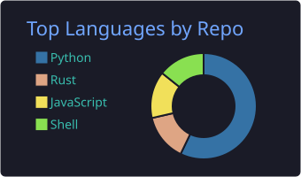
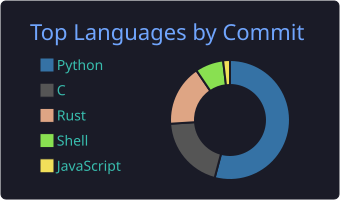
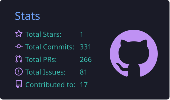
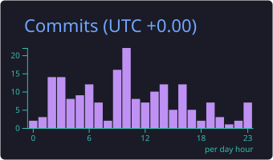

[English](README.md) | 中文

# 李响 👋

> **Agent-native 工程师 —— 构建面向 agent 驱动开发的治理层**

💼 Agent-Native 软件开发工程师 @ Strategy · 🎓 华中科技大学 计算机科学 · 📍 中国杭州

## 🔭 关于我

- **Agent-native 工程师**：agent 是我构建软件的默认方式——让 coding agent 干活，用确定性基础设施（gates、notes、机械检查）守住质量线
- 研究兴趣：Agent 控制流架构、LLM 推理与 serving、GPU 集群调度
- 核心技术栈：**Python / C**，跑在 **Kubernetes** 上

## 🚀 精选项目

| 项目 | 简介 |
| --- | --- |
| [**govrail**](https://github.com/Lixiang9716/govrail) | 语言无关的 agent 驱动开发治理平面：**gates** 把任何可检查的承诺变成机械检查，**notes** 记录每个决策及其落选方案。已发布 [PyPI](https://pypi.org/project/govrail/) |
| [**devflow**](https://github.com/Lixiang9716/devflow) | AI 驱动的结构化软件工程多 Agent 系统：五阶段门禁模型（需求→可行性→架构→实现→验证），LLM 只负责推理与决策，产物由确定性工具生成 |
| [**LCode**](https://github.com/Lixiang9716/LCode) | Rust 实现的终端 CLI code agent：自主规划、读写文件、执行命令，支持 OpenAI / Anthropic 后端 |
| [**dsh-issue-bot**](https://github.com/Lixiang9716/dsh-issue-bot) | DeepSeek Harness 宿主插件：监听 GitHub 新 issue 自动派发 agent 处理，内置轮询模式，无需公网 IP |

## 📊 GitHub 统计

<!-- 由 GitHub Actions 自动生成（见 .github/workflows/），不依赖第三方图床 -->

| | |
| --- | --- |
|  |  |
|  |  |

<picture>
  <source media="(prefers-color-scheme: dark)" srcset="https://raw.githubusercontent.com/Lixiang9716/Lixiang9716/output/github-snake-dark.svg" />
  <source media="(prefers-color-scheme: light)" srcset="https://raw.githubusercontent.com/Lixiang9716/Lixiang9716/output/github-snake.svg" />
  
</picture>

---

📫 欢迎通过 GitHub Issue / Discussion 交流 agent 治理、LLM 系统相关话题
